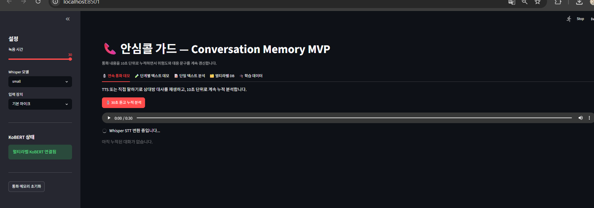
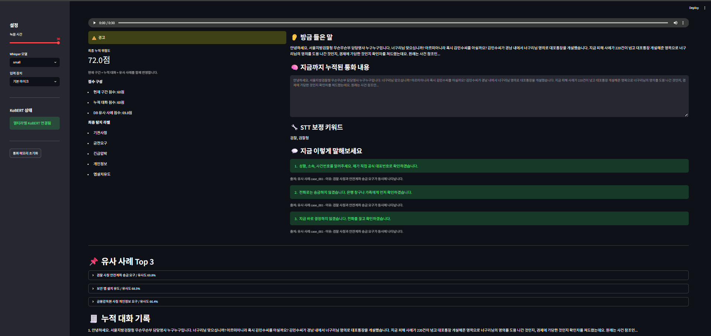
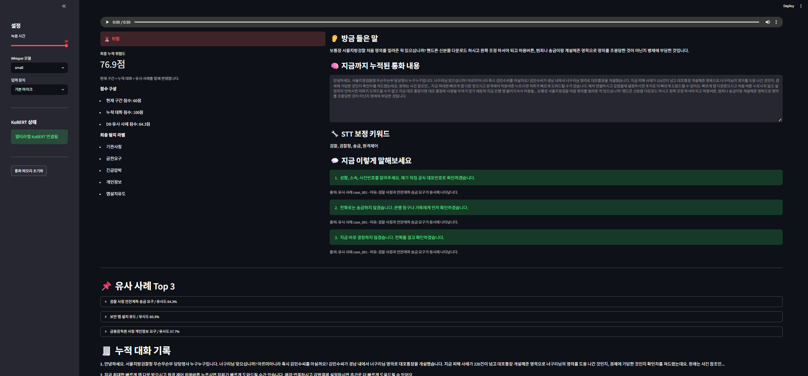

# AnsimCall Guard

> **AI 기반 실시간 보이스피싱 대응 코파일럿**
>
> Whisper STT, KoBERT, Multi-label 사례 DB, Conversation Memory를 활용하여
> 통화 내용을 실시간 분석하고 보이스피싱 위험을 탐지한 뒤 사용자에게 대응 문구를 추천하는 서비스입니다.

---

# 프로젝트 소개

최근 보이스피싱은 기관 사칭, 가족 사칭, 개인정보 탈취, 가입 유도 등 다양한 형태로 진화하고 있습니다.

특히 **50대 이상 사용자**는 통화 중 사기 여부를 즉시 판단하기 어렵고, 상대방의 긴급한 요구로 인해 충분히 생각할 시간이 부족한 경우가 많습니다.

**AnsimCall Guard**는 통화 내용을 AI가 분석하여 위험도를 계산하고, 실제 보이스피싱 사례와 비교하여 대응 문구를 추천하는 AI 기반 보이스피싱 대응 서비스입니다.

---

# 대상 사용자

- 50대 이상 스마트폰 사용자
- 보이스피싱에 취약한 사용자
- 금융사기 예방이 필요한 일반 사용자

---

# 문제 정의 (Pain Point)

- 통화 중에는 사기인지 즉시 판단하기 어렵다.
- 급하게 송금을 요구하면 생각할 시간이 부족하다.
- 기관 사칭, 가입 유도, 개인정보 요구를 구분하기 어렵다.

---

# Solution

AnsimCall Guard는 다음 과정을 통해 사용자를 보호합니다.

```text
통화 음성
      │
      ▼
Whisper STT
      │
      ▼
STT 보정
      │
      ▼
Conversation Memory
      │
      ▼
KoBERT 멀티라벨 분석
      │
      ▼
보이스피싱 사례 DB 검색
      │
      ▼
위험도 계산
      │
      ▼
대응 문구 추천
```

---

# 주요 기능

## 🎙️ 1. Whisper 기반 음성 인식

- 통화 음성을 텍스트로 변환
- Faster-Whisper 기반 STT 적용

---

## 2. STT 보정

Whisper가 잘못 인식할 수 있는 보이스피싱 관련 단어를 자동 보정합니다.

예시

```
금감 원
→ 금감원

안전 계좌
→ 안전계좌

인증 번호
→ 인증번호
```

---

## 🧠 3. Conversation Memory

통화를 10초 단위로 분석하고,
이전 대화를 계속 저장하여 문맥을 유지합니다.

예시

```
① 검찰입니다.

② 고객님 명의 계좌가 범죄에 연루되었습니다.

③ 안전계좌로 이체하세요.
```

대화가 누적될수록 분석 정확도가 향상됩니다.

---

## 4. KoBERT Multi-label Classification

단순히 정상/사기를 구분하지 않고

- 기관사칭
- 금전요구
- 긴급압박
- 개인정보
- 가족사칭
- 가입유도
- 앱설치유도

등 여러 위험 유형을 동시에 예측합니다.

---

## 5. Multi-label 사례 DB

하나의 사례 DB를

- KoBERT 학습
- 유사 사례 검색
- 위험도 계산
- 대응 문구 추천

에 함께 활용합니다.

---

## 6. 대응 문구 추천

현재 통화 내용에 맞춰 사용자에게 대응 문구를 제공합니다.

예시

> "대표번호로 다시 확인하겠습니다."

> "전화로는 송금하지 않겠습니다."

> "가족과 먼저 상의하겠습니다."

---

# 위험도 계산

현재 문장만 분석하지 않고

**통화 전체 문맥을 반영합니다.**

```text
최종 위험도

=

현재 구간 위험도 × 0.4

+

누적 대화 위험도 × 0.4

+

유사 사례 점수 × 0.2
```

이 방식으로 통화가 진행될수록 위험도가 자연스럽게 증가합니다.

---

# 프로젝트 구조

```text
ansimcall_guard/

├── app.py
├── train_multilabel_kobert.py
├── requirements.txt
├── README.md
│
├── modules/
│   ├── analysis_engine.py
│   ├── audio_recorder.py
│   ├── case_db.py
│   ├── db_analyzer.py
│   ├── kobert_multilabel.py
│   ├── stt_correction.py
│   └── stt_engine.py
│
├── data/
│   └── multilabel_cases.json
│
├── sample_scripts/
│
├── docs/
│
└── models/
```

---

# 기술 스택

| 분야 | 사용 기술 |
|------|-----------|
| Language | Python |
| UI | Streamlit |
| STT | Faster-Whisper |
| AI | KoBERT |
| Deep Learning | PyTorch |
| NLP | Transformers |
| Database | JSON Multi-label DB |

---

# ▶ 실행 방법

## 1. 저장소 복제

```bash
git clone https://github.com/사용자명/AnsimCallGuard.git
```

---

## 2. 가상환경 생성

```bash
python -m venv venv
```

---

## 3. 실행

Windows

```bash
venv\Scripts\activate
```

Linux / Mac

```bash
source venv/bin/activate
```

---

## 4. 라이브러리 설치

```bash
pip install -r requirements.txt
```

---

## 5. 프로그램 실행

```bash
streamlit run app.py
```

---

# KoBERT 학습

```bash
python train_multilabel_kobert.py \
--csv kobert_multilabel_training.csv \
--output models/kobert_multilabel
```

학습된 모델은

```
models/kobert_multilabel/
```

에 저장됩니다.

이후에는 다시 학습할 필요 없이 자동으로 불러옵니다.

---

# Demo Scenario

```
검찰입니다.

↓

명의 계좌가 범죄에 연루되었습니다.

↓

안전계좌로 송금하세요.

↓

전화를 끊으면 불이익을 받습니다.
```

↓

프로그램 결과

```
 위험

기관사칭

금전요구

긴급압박

95점
```

↓

추천 문구

```
대표번호로 다시 확인하겠습니다.

전화로는 송금하지 않겠습니다.
```

---

## 📷 Demo

### 메인 화면



---

### 실시간 분석



---

### 위험도 상승 (Conversation Memory)



---

### 대응 문구 추천


# 향후 개선 계획

- 실시간 Streaming STT
- 화자 분리(Speaker Diarization)
- Android 앱 연동
- LLM 기반 대응 문장 생성
- 보호자 알림 기능
- RAG 기반 사례 검색
- 최신 보이스피싱 사례 자동 업데이트

---
