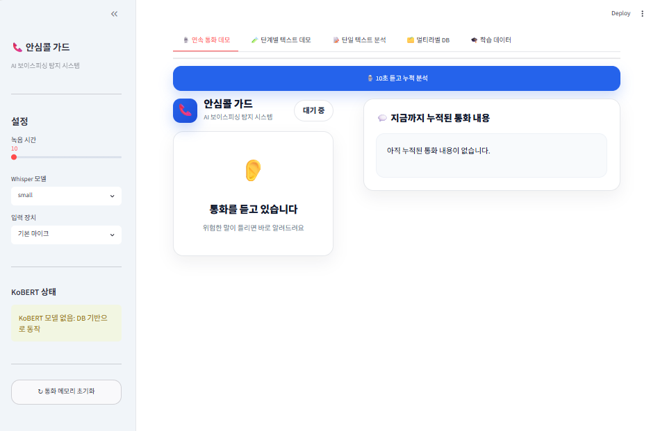
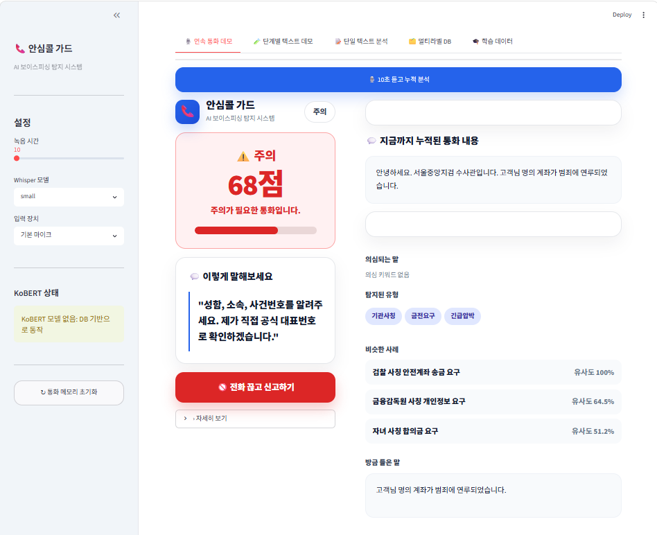

# 📞 AnsimCall Guard

> **AI 기반 실시간 보이스피싱 탐지 및 대응 시스템**
>
> 음성 인식(STT), Conversation Memory, KoBERT 멀티라벨 분류, 사례 기반 위험도 분석을 결합하여 보이스피싱 통화를 실시간으로 분석하고 대응 문구를 제공하는 AI 시스템입니다.

---

## 📌 Overview

AnsimCall Guard는 통화 내용을 **10초 단위로 지속적으로 분석**하여 보이스피싱 위험도를 계산하는 AI 기반 보안 시스템입니다.

기존 보이스피싱 탐지 시스템이 한 문장만 분석하는 것과 달리,

- **Conversation Memory**
- **KoBERT 멀티라벨 분류**
- **사례 기반 검색(Retrieval)**
- **누적 위험도 계산**

을 함께 사용하여 통화가 진행될수록 더욱 정확한 판단을 수행합니다.

---

# ✨ Features

## 🎙 Real-time Speech Recognition

- Faster-Whisper 기반 음성 인식(STT)
- 10~30초 단위 음성 녹음
- 한국어 음성 인식

---

## 🧠 Conversation Memory

통화 내용을 계속 누적하여

- 이전 대화 기억
- 통화 흐름 분석
- 누적 위험도 계산

을 수행합니다.

---

## 🤖 KoBERT Multi-label Classification

보이스피싱 유형을 동시에 분류합니다.

지원 라벨

- 기관사칭
- 금전요구
- 긴급압박
- 개인정보요구
- 앱설치유도
- 원격제어

---

## 📚 Case-based Retrieval

멀티라벨 사례 DB를 이용하여

- 유사 사례 Top3 검색
- 위험도 보정
- 대응 문구 추천

을 수행합니다.

---

## 📊 Hybrid Risk Scoring

최종 위험도는

- 현재 구간 위험도
- Conversation Memory 위험도
- 사례 DB 유사도

를 함께 고려하여 계산됩니다.

```text
Final Risk Score

= Current Segment Score × 0.4
+ Conversation Memory Score × 0.4
+ Similar Case Score × 0.2
```

---

## 💬 AI Response Recommendation

위험 상황에서는 즉시 대응 문구를 제공합니다.

예시

> "전화로는 송금하지 않겠습니다.
>
> 공식 대표번호로 다시 확인하겠습니다."

---

## 🚨 신고 기능(UI)

위험도가 높을 경우

- 전화 끊고 신고하기 버튼
- 위험도 시각화
- 대응 문구 제공

을 통해 사용자가 즉시 대응할 수 있도록 설계했습니다.

(현재 신고 기능은 UI만 구현되어 있으며 향후 경찰청/금융감독원 신고 시스템과 연동 예정입니다.)

---

# 🖥 Dashboard

현재 Dashboard에서는

- ✅ 실시간 위험도 표시
- ✅ 위험도 Progress Bar
- ✅ Conversation Memory
- ✅ 대응 문구 추천
- ✅ 유사 사례 Top3
- ✅ 탐지 라벨 표시
- ✅ 신고 버튼(UI)

을 제공합니다.

---

# 🏗 System Architecture

```text
                Voice

                  │

                  ▼

         Audio Recorder

                  │

                  ▼

         Faster-Whisper STT

                  │

                  ▼

          STT Correction

                  │

                  ▼

      Conversation Memory

         │              │

         ▼              ▼

 KoBERT Multi-label   Similar Case Retrieval

         │              │

         └──────┬───────┘

                ▼

      Hybrid Risk Scoring

                ▼

     Response Recommendation

                ▼

          Streamlit Dashboard
```

---

# 📂 Project Structure

```text
ansimcall_guard/

│

├── app.py
├── dashboard.py
├── requirements.txt
├── README.md

│

├── modules/
│   ├── analysis_engine.py
│   ├── audio_recorder.py
│   ├── case_db.py
│   ├── kobert_multilabel.py
│   ├── stt_engine.py
│   └── ...

│

├── models/
│   └── kobert_multilabel/

│

├── data/

│

├── database/

│

└── images/
```

---

# ⚙ Tech Stack

| Category | Technology |
|----------|------------|
| Language | Python |
| UI | Streamlit |
| Speech Recognition | Faster-Whisper |
| NLP | KoBERT |
| Deep Learning | Transformers |
| Database | JSON Case Database |
| Audio | SoundDevice |
| Visualization | Streamlit Dashboard |

---

# ▶ Installation

```bash
git clone https://github.com/mainymlee/ansimcall_guard.git

cd ansimcall_guard

python -m venv venv

venv\Scripts\activate

pip install -r requirements.txt

streamlit run app.py
```

---

# 📸 Demo

## Main Dashboard



---

## Voice Phishing Detection



---

## Similar Case Retrieval


---

# 🚀 Future Work

- 경찰청 신고 API 연동
- 금융감독원 신고 기능
- Android 모바일 앱
- LLM 기반 대응 문구 생성
- 사용자 맞춤 위험도 분석
- 실시간 전화 앱 연동

---

# 👨‍💻 Team

**AnsimCall Guard**

AI-based Voice Phishing Detection & Response System

Developed using

- Faster-Whisper
- KoBERT
- Conversation Memory
- Case-based Retrieval
- Streamlit Dashboard
