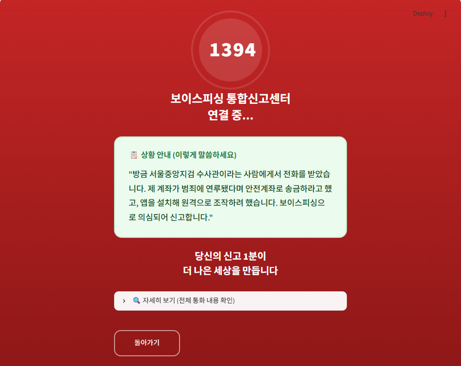

# 📞 AnsimCall Guard

> **AI 기반 실시간 보이스피싱 탐지 및 대응 시스템**

Whisper STT, Conversation Memory, KoBERT 멀티라벨 분류, 사례 기반 검색(Case Retrieval), LLM 2차 검증을 결합하여 보이스피싱 통화를 실시간으로 탐지하고 대응 문구를 제공하는 AI 시스템입니다.

---

# 📌 프로젝트 소개

기존 보이스피싱 탐지 시스템은 한 문장만 분석하는 경우가 많습니다.

AnsimCall Guard는 통화 내용을 **10초 단위로 지속적으로 분석**하며,

- Conversation Memory
- KoBERT 멀티라벨 분류
- 사례 기반 검색(Case Retrieval)
- Hybrid Risk Scoring
- LLM 2차 검증

을 결합하여 통화가 길어질수록 더욱 정확하게 보이스피싱 여부를 판단합니다.

또한 사용자의 신고 데이터를 활용하여 **지속적으로 성장하는 AI 탐지 시스템**을 목표로 합니다.

---

# ✨ 주요 기능

## 🎙 음성 인식(STT)

- Faster-Whisper 기반 STT
- 10~30초 단위 음성 인식
- 한국어 음성 지원

---

## 🧠 Conversation Memory

통화 내용을 지속적으로 누적하여

- 이전 대화 기억
- 통화 흐름 분석
- 누적 위험도 계산

을 수행합니다.

---

## 🤖 KoBERT 멀티라벨 분류

다음 보이스피싱 유형을 동시에 탐지합니다.

- 기관사칭
- 금전요구
- 긴급압박
- 개인정보요구
- 앱설치유도
- 원격제어

---

## 📚 사례 기반 검색 (Case Retrieval)

사례 DB에서 유사한 보이스피싱 사례를 검색하여

- 유사 사례 Top3
- 위험도 보정
- 대응 문구 추천

을 제공합니다.

---

## 📊 Hybrid Risk Scoring

최종 위험도는

- 현재 구간 위험도
- Conversation Memory 위험도
- 사례 DB 유사도

를 함께 고려하여 계산됩니다.

```text
Final Risk Score

= 현재 구간 점수 × 0.4
+ Conversation Memory × 0.4
+ 사례 DB 점수 × 0.2
```

---

## 🤖 LLM 2차 검증

위험도가 **60점 이상**인 통화는 LLM이 한 번 더 분석합니다.

LLM은

- 보이스피싱 여부 재판단
- 위험도 보정
- 보이스피싱 라벨 자동 부여
- 핵심 키워드 추출
- 개인정보 제거 요약
- 대응 문구 보정

을 수행하여 탐지 정확도를 높입니다.

---

## 🚨 신고 기능

LLM 검증이 완료된 고위험 통화는

**🚨 전화 끊고 신고하기**

버튼이 활성화됩니다.

신고 시

- LLM이 정제한 요약
- 위험도
- 라벨
- 키워드

를 함께 저장합니다.

저장 위치

```text
database/reported_cases.json
```

---

# 🌱 성장형 AI 모델

AnsimCall Guard는 단순 탐지 시스템이 아니라

**사용할수록 성장하는 AI**를 목표로 합니다.

```text
통화

↓

Whisper STT

↓

Conversation Memory

↓

KoBERT

↓

Hybrid Risk Score

↓

위험도 60 이상

↓

LLM 2차 검증

↓

신고 버튼

↓

reported_cases.json 저장

↓

향후 KoBERT 재학습

↓

탐지 성능 향상
```

---

# 🖥 Dashboard

Dashboard에서는

- ✅ 실시간 위험도
- ✅ Progress Bar
- ✅ Conversation Memory
- ✅ 유사 사례 Top3
- ✅ 탐지 라벨
- ✅ LLM 검증 결과
- ✅ AI 대응 문구
- ✅ 신고 버튼
- ✅ 신고 DB

를 제공합니다.

---

# 🏗 시스템 구조

```text
                 Voice Call

                      │

                      ▼

              Audio Recorder

                      │

                      ▼

           Faster-Whisper STT

                      │

                      ▼

            STT Text Correction

                      │

                      ▼

          Conversation Memory

             │               │

             ▼               ▼

     KoBERT Multi-label   Case Retrieval

             │               │

             └───────┬───────┘

                     ▼

         Hybrid Risk Scoring

                     │

                     ▼

            위험도 ≥ 60 ?

                     │

                     ▼

          LLM 2차 검증

                     │

                     ▼

      신고 DB 자동 저장

                     │

                     ▼

        Streamlit Dashboard
```

---

# 📂 프로젝트 구조

```text
ansimcall_guard/

├── app.py
├── requirements.txt
├── README.md

├── modules/
│   ├── analysis_engine.py
│   ├── audio_recorder.py
│   ├── case_db.py
│   ├── kobert_multilabel.py
│   ├── llm_verifier.py
│   ├── report_manager.py
│   └── stt_engine.py

├── models/
│   └── kobert_multilabel/

├── database/
│   ├── case_database.json
│   └── reported_cases.json

├── data/

└── images/
```

---

# ⚙ 기술 스택

| 분야 | 기술 |
|------|------|
| Language | Python |
| UI | Streamlit |
| STT | Faster-Whisper |
| NLP | KoBERT |
| LLM | Gemini 2.5 Flash |
| Framework | HuggingFace Transformers |
| Database | JSON |
| Audio | SoundDevice |

---

# ▶ 실행 방법

```bash
git clone https://github.com/mainymlee/ansimcall_guard.git

cd ansimcall_guard

python -m venv venv

venv\Scripts\activate

pip install -r requirements.txt

streamlit run app.py
```

---

# 📸 실행 화면

## 메인 화면


---

## 위험 탐지 화면


---

## 신고 화면



---

# 🚀 향후 계획

- 경찰청 신고 API 연동
- 금융감독원 신고 API 연동
- Android 앱 개발
- 신고 DB 기반 자동 KoBERT 재학습
- 지속적으로 성장하는 탐지 모델 구현
- 실시간 전화 앱 연동

---

# 👨‍💻 Team

**AnsimCall Guard**

AI 기반 보이스피싱 탐지 및 대응 시스템

### 핵심 기술

- Faster-Whisper
- Conversation Memory
- KoBERT Multi-label Classification
- Case Retrieval
- Gemini 2.5 Flash
- LLM Secondary Verification
- Streamlit Dashboard
